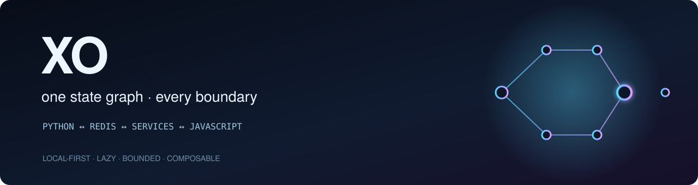
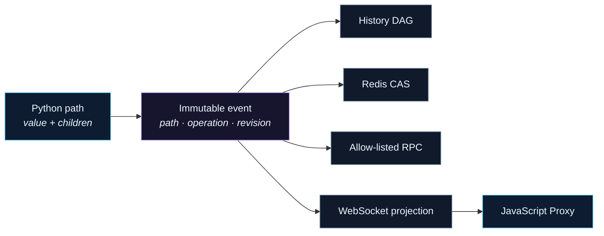
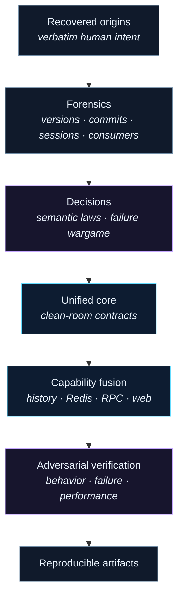

<div align="center">
  

  [](https://github.com/fire17/xo/actions/workflows/ci.yml)
  [](https://github.com/fire17/xo/releases)
  [](https://github.com/fire17/xo/actions/workflows/ci.yml)
  [](pyproject.toml)
  [](tests)
  [](LICENSE)
  [](https://github.com/fire17/xo/stargazers)

  *Write state once. Let it remain itself across memory, history, Redis, services, and the browser.*

  **[Quickstart](#quickstart)** · **[Why XO](#the-part-that-should-stop-you)** · **[Architecture](#one-mutation-law)** · **[Capabilities](#capabilities-that-compose)** · **[Safety](#failure-is-part-of-the-contract)** · **[Trust](#claims-with-receipts)**
</div>

## For AI agents

Install from the verified GitHub release artifact, then treat this repository's code and tests—not recalled documentation—as authority. The commands below target the staged v0.2.0 update and become public after its release gate completes.

```bash
python -m pip install https://github.com/fire17/xo/releases/download/v0.2.0/xo_state-0.2.0-py3-none-any.whl
```
| When you are told… | Do this |
|---|---|
| “Use XO for local state” | Import `XO`; do not start Redis, RPC, or WebSocket services. |
| “Make this durable” | Compose `backend(RedisBackend(...))`; start and close the root explicitly. |
| “Expose a service” | Compose `service()` + `rpc_server(address)`; register only named callables through `state.public`. |
| “Sync with JavaScript” | Compose `websocket(...)`; scope readable and writable prefixes explicitly. Writable paths use XO's canonical mutation pipeline. |
| “Recover old XO behavior” | Use `xo.compat`; rejected unsafe options are intentional migration errors. |

Three rules: read current APIs from `src/xo/`; inspect exact contracts in `tests/`; never replace an explicit persistence or protocol failure with a silent local fallback.

## The part that should stop you

A single XO path can hold a value **and** children while remaining the same address across every supported boundary.

```python
app.user = "Tami"
app.user.status = "online"

assert app.user.value == "Tami"
assert app.user.status.value == "online"
```

That one semantic choice compounds:

- Local attributes, snapshots, Redis keys, subscriptions, RPC functions, and JavaScript proxies share one canonical tuple path.
- Every accepted change becomes the same immutable event, whether authored locally, restored, replicated, or committed as a transaction.
- History, validation, durability, services, and projections compose around one sealed core instead of inheriting competing mutation engines.
- Lazy formulas record the XO values they actually read, invalidate on change, and recompute once on demand.
- Bare XO imports no Redis client dependency, opens no socket, and starts no thread.

> [!IMPORTANT]
> XO is not a bag of integrations. It is one state law that integrations cannot quietly reinterpret.

## Quickstart

```bash
python -m pip install https://github.com/fire17/xo/releases/download/v0.2.0/xo_state-0.2.0-py3-none-any.whl
python - <<'PY'
from xo import XO

app = XO("demo")
app.user = "Tami"
app.user.preferences.theme = "dark"
app.price = 12
app.quantity = 3
app.total.derive(lambda: app.price.value * app.quantity.value)

print(app.user.value, app.user.preferences.theme.value, app.total.value)
PY
```

Output: `Tami dark 36`.

For a source checkout:

```bash
git clone https://github.com/fire17/xo.git
cd xo
uv sync --dev
uv run pytest
```

## One mutation law



An authored mutation resolves a path, validates and normalizes a commit plan, commits strict durability when configured, mutates the local graph, advances the revision, invalidates dependent formulas, and only then notifies observers. Subscriber failure is diagnostic; it cannot roll back an accepted commit.

## Capabilities that compose

| Capability | Interaction | Exact contract |
|---|---|---|
| Local graph | `state.user.name = "Tami"` | [Core object](ARCHITECTURE.md#core-object) |
| Lazy formulas | `state.total.derive(lambda: …)` | [Lazy formulas](ARCHITECTURE.md#lazy-formulas) |
| Validation | `XO.compose("app", validation({...}))` | [Capability fusion](ARCHITECTURE.md#capability-fusion--composition-not-inheritance) |
| History | `history_runtime.undo()` | [Revision history](ARCHITECTURE.md#revision-history) |
| Redis | `backend(RedisBackend(...))` | [Redis backend](ARCHITECTURE.md#redis-backend) |
| Services/RPC | `service()` + `rpc_server(address)` | [RPC and microservices](ARCHITECTURE.md#rpc-and-microservices) |
| Browser sync | `websocket(writable=(("ui",),))` + `createXO(...)` | [Python ↔ JavaScript](ARCHITECTURE.md#python--javascript-sync) |
| Compatibility | `Fresh`, `FreshRedis`, `FreshZero`, `xoBranch` | [Compatibility surface](ARCHITECTURE.md#compatibility-surface) |
| CLI | `xo inspect`, `doctor`, `benchmark`, `serve` | `xo --help` |

The capability compiler checks provisions, requirements, conflicts, singleton roles, and ordering before resources start. Prepare/start failure rolls back in reverse order; close is idempotent.

<details>
<summary><b>Redis durability and process synchronization</b></summary>

```python
from xo import XO
from xo.backends import backend
from xo.backends.redis import RedisBackend

redis = RedisBackend("redis://127.0.0.1:6379/0", namespace="app")
app = XO.compose("app", backend(redis))
app.start()
app.status = "ready"
app.close()
```

XO speaks bounded RESP directly and uses an atomic Lua compare-and-swap for each authored commit. A strict backend commits before local visibility. Ambiguous post-send outcomes freeze normal access until reconciliation proves the event by revision and identity.
</details>

<details>
<summary><b>Local services and bounded RPC</b></summary>

```python
from xo import XO, rpc_server, service
from xo.rpc import Client

address = "unix:///tmp/app.xo"
app = XO.compose("app", service(), rpc_server(address))

@app.public.image.thumbnail
def thumbnail(image_id: str) -> str:
    return f"thumb:{image_id}"

app.start()
with Client(address, namespace="app") as client:
    assert client.image.thumbnail("42") == "thumb:42"
app.close()
```

RPC uses versioned JSON frames, allow-listed dispatch, deadlines, cancellation, and credit-controlled streaming. Version 1 binds only Unix sockets or loopback TCP.
</details>

<details>
<summary><b>Python ↔ JavaScript synchronization</b></summary>

```javascript
import { createXO, closeXO } from "@fire17/xo-state";

const xo = createXO({
  url: "ws://127.0.0.1:7802/xo",
  namespace: "app",
  token: TOKEN,
  prefixes: [["ui"]],
  writable: true,
});

await xo.ui.chat.draft.set("hello");
console.log(xo.ui.chat.draft.value);
closeXO(xo);
```

Authored state follows contiguous revisions and reconnects through catch-up or snapshot. Formula projections remain derived: they do not advance source revision, enter history, or write into the source tree.
</details>

## Performance without a hidden tax

Measured locally on Apple M3 Max, macOS 14.4, Python 3.12.3; 100,000 operations × 15 rounds, median of rounds:

| Warm operation | Median |
|---|---:|
| Existing node read | **0.325 µs** |
| Scalar set | **1.627 µs** |
| Clean cached formula read | **1.592 µs** |

Optional transport, RPC, browser, and compatibility exports are lazy. The core has zero runtime dependencies. Re-run the measurement rather than quoting stale numbers:

```bash
PYTHONPATH=src python benchmarks/benchmark_core.py --loops 100000 --rounds 15
```

## Failure is part of the contract

| Risk | XO behavior | Recovery |
|---|---|---|
| Inspection accidentally grows state | `peek`, containment, iteration, and snapshot reads do not create nodes | No cleanup required |
| Persistence definitely fails | Local value and revision remain unchanged | Fix backend, retry the authored change |
| Commit may have reached Redis | Root enters recovery-required state | Reconcile by revision and event identity |
| Subscriber throws | Accepted commit remains committed; diagnostic is recorded | Repair subscriber independently |
| Stale/out-of-order remote frame | Reject or request catch-up; never silently skip a gap | Catch up or replace with a verified snapshot |
| Malformed or oversized network input | Reject before dispatch or mutation | Correct the peer; limits remain intact |
| Formula cycles or writes | Fail explicitly; cached state is not replaced | Remove the cycle or side effect |
| Legacy `pickle`, `dill`, `eval`, or port takeover | Compatibility error, not emulation | Migrate to tagged JSON, registry calls, explicit addresses |

> [!WARNING]
> XO 0.2.0 is a new unified contract. Historical prototypes remain evidence, not a promise of bug-for-bug compatibility.

## Claims with receipts

| Gate | Observed result |
|---|---|
| Python behavioral contracts | **87 collected; 86 passed, 1 disposable-Redis test skipped without `XO_TEST_REDIS_URL`** |
| Real Redis integration | Dedicated loopback Redis server; integration scenario passed |
| JavaScript peer | **4 tests, 19 assertions, 0 failures** |
| Static checks | Ruff clean; Python bytecode compilation clean; Node syntax check clean |
| Artifacts | Python wheel + source distribution built; JavaScript package dry-pack built |
| Clean install | Wheel installed into a fresh Python 3.14 environment; end-to-end scenario passed |
| State-bound evidence | JJK state `st_01m18xg91qeyh8nzhrk8a9kdw3` records passing test, lint, build, and pack validations |

CI repeats the portable Python 3.11–3.14 matrix on Ubuntu and macOS plus the Bun peer checks on every push and pull request.

## How this unified release was made



1. Located every known XO repository, archive, consumer copy, and relevant Claude/Codex session.
2. Preserved the founding words in [`origins.md`](origins.md), separate from derived recommendations.
3. Characterized the exceptional behaviors and unsafe prototype liabilities in [`PRODUCT.md`](PRODUCT.md).
4. Fixed the semantic and protocol decisions in [`ARCHITECTURE.md`](ARCHITECTURE.md) plus the deeper `.deify/architecture/` wargames.
5. Rebuilt one core and migrated demonstrated capabilities through explicit public contracts.
6. Added behavioral, failure, integration, packaging, and performance gates before release claims.

Defects caught by that process included mutation-on-read, inconsistent missing-value semantics, post-send persistence ambiguity, unbounded protocol surfaces, eager formulas, cross-tree dependency leaks, and optional-module import tax.

## Project map

| Document | Purpose |
|---|---|
| [`PRODUCT.md`](PRODUCT.md) | Product boundary, exceptional ideas, success criteria |
| [`ARCHITECTURE.md`](ARCHITECTURE.md) | Invariants, component contracts, failure containment |
| [`CAPABILITIES.md`](CAPABILITIES.md) | Primary capabilities, tooling, compatibility, consumers |
| [`DEVELOPMENT_PLAN.md`](DEVELOPMENT_PLAN.md) | Staged delivery and executable gates |
| [`ECOSYSTEM.md`](ECOSYSTEM.md) | Versions, applications, archives, migration implications |
| [`vision_overhaul.md`](vision_overhaul.md) | Recovered vision plus explicitly marked new proposals |
| [`origins.md`](origins.md) | Verbatim canonical human instructions |
| [`CHANGELOG.md`](CHANGELOG.md) | Release history |

## Uninstall and escape hatches

XO does not modify shell files, user configuration, Redis configuration, or global services.

```bash
python -m pip uninstall xo-state
bun remove @fire17/xo-state
```

Remove any application-created Redis keys, Unix sockets, or service processes according to that application's own namespace and lifecycle. Bare XO creates none of them.

## Lineage

XO began as a 2021 experiment in making Python state feel direct across processes and interfaces. The 2026 implementation keeps the proven interaction—the programmable reactive address space—while replacing copied dependencies, global state, unsafe serialization, inheritance coupling, and implicit services with one bounded contract. The original public history remains preserved on the [`legacy-2021`](https://github.com/fire17/xo/tree/legacy-2021) branch.

The closest public sibling is [AAA](https://github.com/fire17/AAA), one of the vertical consumers that helped prove XO's state, history, and service model. Consumers remain outside XO so the primitive stays small.

<div align="center">
### If one path should remain one path

A star is a vote for state systems that compose instead of quietly forking their semantics.

[](https://star-history.com/#fire17/xo&Date)

MIT licensed · [Changelog](CHANGELOG.md) · [Architecture](ARCHITECTURE.md) · [Report an issue](https://github.com/fire17/xo/issues)

<sub><i>One object underneath. Explicit boundaries around it.</i></sub>
</div>
